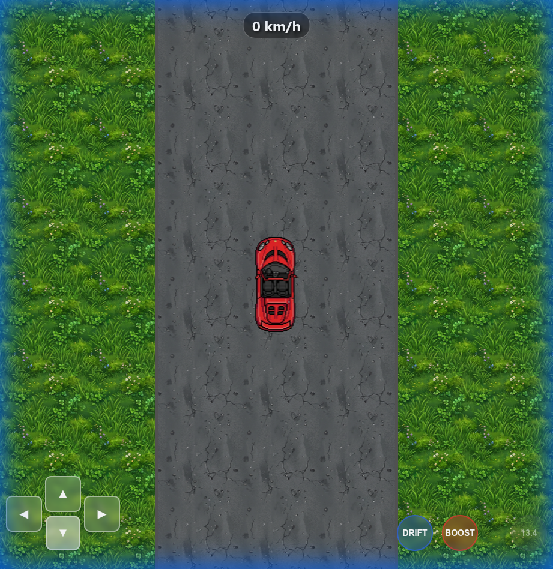

# Open World Car Game

A 2D open-world car game optimized for mobile browsers, built with JavaScript and HTML5.



## Features
- **Procedural Infinite World**:
    - **Endless Road**: A single straight highway that loops infinitely.
    - **Dynamic Environment**: Trees and stones are recycled as you drive, creating an endless landscape.
- **Arcade Physics**:
    - **Drift**: Slide around corners with smoke effects.
    - **Boost**: Temporary speed burst.
    - **NOS**: Instantly jumps to Triple Max Speed for 2s, 5s fade, with random 10-30s cooldown.
    - **Auto-Collision**: Bouncing off obstacles.
- **Mobile Controls**: On-screen D-Pad and action buttons.
- **UI**:
    - **Speedometer**: Real-time speed display in km/h.

## Documentation
- **[Implementation Plan](implementation_plan.md)**: Details the architecture and file structure.
- **[Troubleshooting Log](troubleshoot.md)**: Notes on bugs encountered (e.g., asset loading issues) and their fixes.
- **[Walkthrough] (walkthrough.md)**: Walkthrough of the game first build until final release.

## How to Run
1. Clone the repo.
2. Serve the directory with a simple HTTP server (to handle image loading security policies).
   ```bash
   python3 -m http.server
   ```
3. Check and configure the port
4. Open `http://localhost:port` in your browser.

## Controls
| Action | Keyboard | Mobile |
|--------|----------|--------|
| Steer  | Arrows / WASD | D-Pad |
| Drift  | Shift / Space | Drift Button |
| Boost  | Enter / B | Boost Button |
| NOS    | N | NOS Button |
