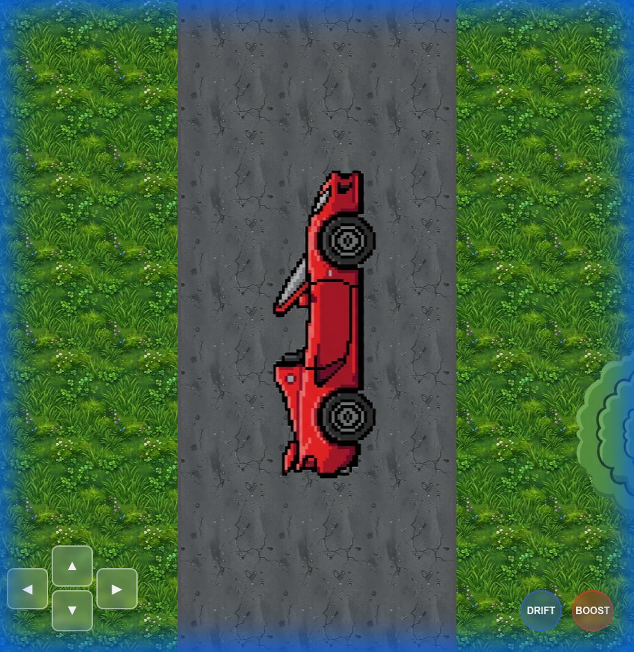

# Open World Car Game Walkthrough

## Overview
A 2D open-world car game optimized for mobile browsers. The game features a procedurally generated infinite-feeling world, arcade car physics with drifting and boosting, and touch controls.

## Features Implemented
- **Procedural World**:
    - Infinite-feeling tiled map.
    - **Straight Roads**: A single endless vertical highway.
    - **Smart Placement**: Trees and stones avoid overlapping each other and roads.
    - **Infinite Gameplay**: Logic automatically recycles terrain objects and extends the road as you drive.
- **Car Physics**:
    - Acceleration and braking with inertia.
    - **Drifting**: Hold Shift (or Drift button) to slide sideways with smoke.
    - **Boost**: Press B (or Boost button) to speed up.
    - **NOS**: Press N (or NOS button) for extreme speed.
        - **Effect**: Instantly hits 3x Max Speed for 2s, then fades over 5s.
        - **Cooldown**: Random 10-30s wait between uses.
    - **Collision**: Car bounces off trees and stones.
- **Mobile Controls**:
    - On-screen D-Pad.
    - **Visual Feedback**: Buttons light up when corresponding keyboard keys are pressed.
- **HUD**:
    - **Speedometer**: Displays current speed in km/h at the top of the screen.

## How to Play
### Desktop (Debug)
- **WASD / Arrows**: Drive and Steer
- **Shift / Space**: Drift
- **Enter / B**: Boost

### Mobile
- **Left D-Pad**: Touch arrows to drive and steer.
- **Right Buttons**: Tap 'Drift' to slide, 'Boost' for speed.

## Verification
The game has been verified to load correctly in a local browser environment.
- Assets load without errors.
- Canvas renders at full screen.
- Controls are interactive with visual feedback.
- Roads and obstacles render correctly.

### Gameplay Screenshot

### NOS Feature Verification

*screenshot demonstrating the NOS button entering cooldown state after activation via 'N' key.*

## Tech Stack
- **HTML5 Canvas**: For high-performance 2D rendering.
- **Vanilla JavaScript**: No external libraries, ensuring fast load times.
- **CSS3**: For responsive UI overlay.

## Project Structure
- `index.html`: Entry point.
- `style.css`: Styling.
- `js/`:
    - `game.js`: Main loop.
    - `car.js`: Physics entity.
    - `world.js`: Map generation.
    - `input.js`: Event handling.
    - `effects.js`: Particle systems.
- `assets/`: Generated placeholder PNGs.
